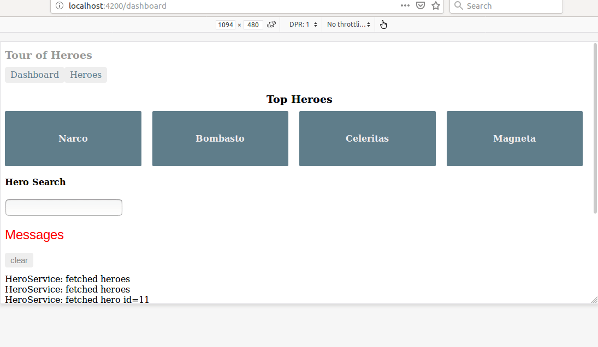

# AngularTourOfHeroes

This project was generated with [Angular CLI](https://github.com/angular/angular-cli) version 7.1.4.

## Development server

Run `ng serve` for a dev server. Navigate to `http://localhost:4200/`. The app will automatically reload if you change any of the source files.

## Code scaffolding

Run `ng generate component component-name` to generate a new component. You can also use `ng generate directive|pipe|service|class|guard|interface|enum|module`.

## Build

Run `ng build` to build the project. The build artifacts will be stored in the `dist/` directory. Use the `--prod` flag for a production build.

## Running unit tests

Run `ng test` to execute the unit tests via [Karma](https://karma-runner.github.io).

## Running end-to-end tests

Run `ng e2e` to execute the end-to-end tests via [Protractor](http://www.protractortest.org/).

## Further help

To get more help on the Angular CLI use `ng help` or go check out the [Angular CLI README](https://github.com/angular/angular-cli/blob/master/README.md).

## Demo



## Server Side Rendering

Server Side Rendering (SSR) is the process of taking a client-side JavaScript Framework website and rendering it to static HTML and CSS on the server. Why is this important? We all want fast loading websites and SSR is a tool to help you get your website rendered faster.

Simply, when a client access the application, request passes to browser, browser load(download) all html, css and js code (converted code of Angular code) and then show it to users. To do all process it takes a long time when application is big, so meanwhile an empty template is vissible which reduces SEO and Performance capibilities of application. So SSR works like, it shows static html, css and in background browser download the js file when this process completes then server render the fully functioned page to user. 

SSR flips the process of rendering a JavaScript framework app and when done right can give your users a better page load.

## Why use Server Side Rendering

Here are three main reasons to create a Universal version of your app.

1. Facilitate web crawlers (SEO)
2. Improve performance on mobile and low-powered devices
3. Show the first page quickly

## SSR with Angular Universal

An Angular application is a Single-page App - it runs in a client’s browser. Angular Universal, however, let’s you also run your Angular app on the server. This enables you serve static HTML to the client. With Angular Universal, the server will pre-render pages and show your users something, while the client-side app loads in the background. Then, once everything is ready client-side, it will seamlessly switch from showing the server-rendered pages to the client-side app. Your users shouldn’t notice a difference, beyond the fact that instead of waiting for your “Loading” spinner to finish, they at least can have some content to keep them engaged until they can start using the fully-featured client-side application.

## Adding Universal to Your App
From your app directory open a terminal and run the following command:

``` $ ng add @nguniversal/express-engine --clientProject {{ name of your project }}```

## Start Your Universal App

From a command line, run the following command:

```$ npm run build:ssr && npm run serve:ssr```

* Open your browser to http://localhost:4000 (or whatever port is configured for you), and you should see your Universal app in action! It won’t look any different, but the first page should load much quicker than your regular Angular application.

* Also, try viewing the page source (right-click on page and select “View Page Source”). You’ll see all normal HTML in the <body> tag that matches what is displayed on your page - meaning, your application can be meaningfully scraped by a web crawler. Compare this with the page source of a non-Universal application, and all you’ll see in the <body> tag is <app-root> (or whatever you’ve called the selector for your bootstrapped AppComponent).

## Deploying an Angular Universal App on Heroku

1. Add a `Procfile`
* How to create a Procfile?
    * The same way you create any file, just name it Procfile with no extension, none at all. 
* What goes in the Procfile?
    * ```web: npm run start:heroku```

2. Edit `package.json`
* Add a line under the scripts object of our package.json and put in the following code:
```“start:heroku”: “node dist/server”```
    * This command will eventually start the node server that will be built by Angular Universal.
* create a `postinstall` script
    * **What is a postinstall script?** 

        A “postinstall” script is a script that is run automatically by Heroku after npm has finished installing all the dependencies on each build. 
In this case, we want to make sure that our dist server is built and ready for deployment by Heroku, so what we can do is kick off the build:ssr command on Heroku’s end, after Heroku has received the code. 

    * **How do I create it?**

        To do this, add another line under the “scripts” object of our package.json file and put in the following code: 
        ```“postinstall”: “npm run build:ssr”```
